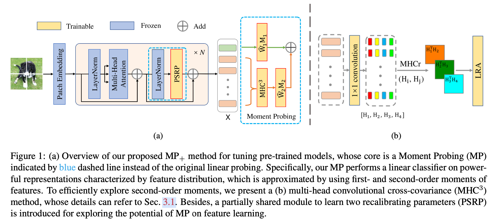
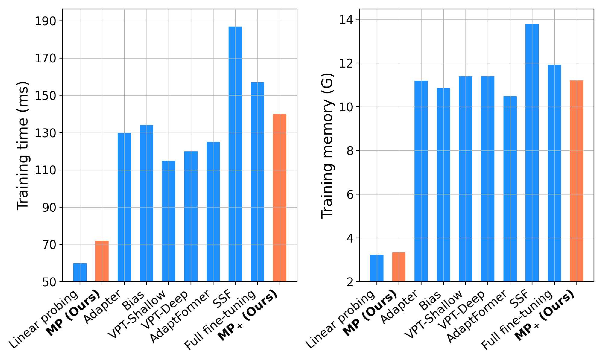

# Tuning Pre-trained Model via Moment Probing

This repo is the official implementation of ICCV 2023 paper "Tuning Pre-trained Model via Moment Probing", created by  Mingze Gao, Qilong Wang and Zhenyi Lin.

## Introduction

In this paper, we propose a Moment Probing (MP) method, which performs a linear classifier on powerful representations characterized by feature distribution to finetune pretrained vision backbones efficiently. A partially shared module is proposed to learn two recalibrating parameters (PSRP), resulting in a complete finetuning framework MP+.

<div align="center">
  
  
</div>

## Usage

### Data preparation

- CIFAR-100
```bash
wget https://www.cs.toronto.edu/~kriz/cifar-100-python.tar.gz
```

- For ImageNet-1K, download it from http://image-net.org/, and move validation images to labeled sub-folders. The file structure should look like:
  ```bash
  $ tree data
  imagenet
  ├── train
  │   ├── class1
  │   │   ├── img1.jpeg
  │   │   ├── img2.jpeg
  │   │   └── ...
  │   ├── class2
  │   │   ├── img3.jpeg
  │   │   └── ...
  │   └── ...
  └── val
      ├── class1
      │   ├── img4.jpeg
      │   ├── img5.jpeg
      │   └── ...
      ├── class2
      │   ├── img6.jpeg
      │   └── ...
      └── ...
 
  ```

- Robustness & OOD datasets

Prepare [ImageNet-A](https://github.com/hendrycks/natural-adv-examples), [ImageNet-R](https://github.com/hendrycks/imagenet-r) and [ImageNet-C](https://zenodo.org/record/2235448#.Y04cBOxByFw) for evaluation.

### Pre-trained model preparation

- For pre-trained ViT-B/16, Swin-B, and ConvNext-B models on ImageNet-21K, the model weights will be automatically downloaded when you fine-tune a pre-trained model. You can also manually download them from [ViT](https://github.com/google-research/vision_transformer),[Swin Transformer](https://github.com/microsoft/Swin-Transformer), and [ConvNext](https://github.com/facebookresearch/ConvNeXt).


- For pre-trained AS-MLP-B model on ImageNet-1K, you can manually download them from [AS-MLP](https://github.com/svip-lab/AS-MLP).


### Tuning Pre-trained Model via Moment Probing

To fine-tune a pre-trained ViT model via `MP` or `MP+` on ImageNet-1K, run:

```bash
bash train_scripts/vit/imagenet_1k/train_mp.sh
bash train_scripts/vit/imagenet_1k/train_mp+.sh
```

Following the scripts we provided, you can easily reproduce our results.


### Robustness & OOD

To evaluate the performance of fine-tuned model via `MP` or `MP+` on Robustness & OOD, run:

```bash
bash train_scripts/vit/imagenet_a(r, c)/eval_mp.sh
```

# checkpoint list (ViT-B/16 SUP)

|Method           | Acc@1(%) | #Params.(M) | log | Checkpoint                                                          |
| ------------------ | ----- | ------- | ----- | ------------------------------------------------------------ |
| Linear Probing (LP)  |  82.04 |  0.77   |  [log](./results/vit/imagenet/linear_probe.csv)   |[params](https://drive.google.com/file/d/1ValKQH8X0Z-IhzO7gf26yioN7fkRAQ5o/view?usp=sharing)|
| Full Finetuning (FT)   |  83.58 |  86.57  | [log](./results/vit/imagenet/full-finetune.csv)    |   [params](https://drive.google.com/file/d/1VrR-s8ztfFMZn8_0ruL-BFl-WOBFWqg_/view?usp=sharing)            |
| Moment Probing (MP)   |  83.15 |    3.65 |  [log](./results/vit/imagenet/mp.csv)   |   [params](https://drive.google.com/file/d/1xEVfOp9F22p51PlbYACM3pKeizb0dizx/view?usp=sharing)            |
| Moment Probing+ (MP+)   | 83.62 |  4.10   | [log](./results/vit/imagenet/mp+.csv)    | [params](https://drive.google.com/file/d/1LybaEmdXqg6niz5hLg14Xn1qrZWFFbBA/view?usp=share_link)|


# Moment-Probing
